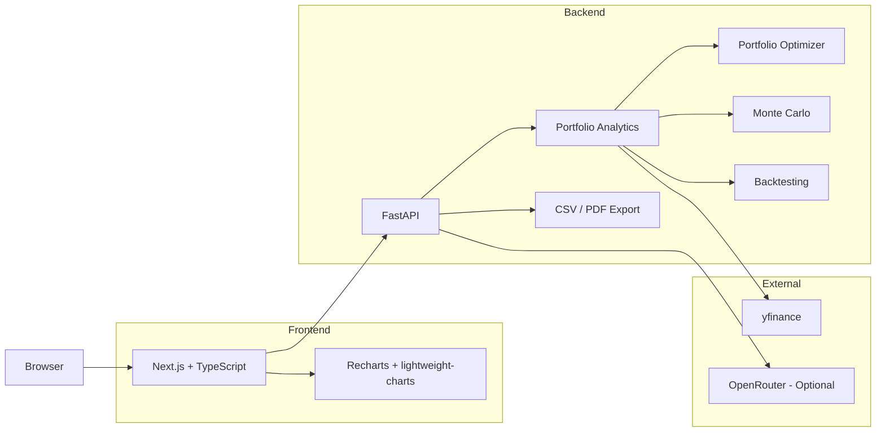

# PortfolioLens

**Build a portfolio, see its risk.**

PortfolioLens is a full-stack portfolio analytics application that turns a set of stocks and portfolio weights into risk, performance, diversification, optimization, and simulation insights.

Instead of looking at each stock individually, PortfolioLens focuses on how the holdings behave **together as a portfolio** using historical market data, portfolio optimization, Monte Carlo simulation, backtesting, and risk analysis.


---

## Features

* **Portfolio analytics** — annualized return, volatility, Sharpe ratio, correlation, alpha, beta, maximum drawdown, and 1-year 95% VaR.
* **Portfolio optimization** — efficient frontier visualization with maximum-Sharpe and minimum-volatility portfolios under long-only constraints.
* **Monte Carlo simulation** — 10-year correlated portfolio simulations with percentile fan bands and risk estimates.
* **Historical backtesting** — compare a portfolio against SPY during custom periods or major market events including the 2008 financial crisis, 2020 COVID crash, and 2022 rate-hike period.
* **Portfolio breakdown** — sector exposure, market-cap distribution, concentration warnings, and correlations between holdings.
* **Rebalancing** — convert target portfolio weights and total portfolio value into whole-share buy and sell orders.
* **Contagion simulation** — model how a price shock to one holding could propagate across correlated assets.
* **Portfolio insights** — rule-based risk signals with optional LLM narration, per-ticker research, and suggested allocations based on risk profile.
* **Utilities** — fuzzy ticker/company search and CSV/PDF report exports.

---

## Architecture



The frontend handles portfolio input and visualization, while the FastAPI backend performs the financial calculations. Portfolio data is processed in memory and is not stored in a database.

---

## Tech Stack

### Backend

* **FastAPI / Python** — API and financial analysis
* **pandas / NumPy** — historical data processing and numerical calculations
* **SciPy** — portfolio optimization
* **yfinance** — historical market data
* **RapidFuzz** — ticker and company search
* **NetworkX** — contagion graph modeling
* **ReportLab** — PDF report generation
* **OpenRouter** — optional LLM narration

### Frontend

* **Next.js 16**
* **TypeScript**
* **Tailwind CSS v4**
* **Zustand**
* **Recharts**
* **lightweight-charts**
* **Radix UI**

---

## How It Works

### Historical Returns

PortfolioLens pulls historical adjusted closing prices through yfinance and aligns holdings across shared trading dates before calculating returns.

Simple daily returns are used so portfolio return remains a weighted combination of the individual holdings:

```text
Portfolio Return = w · μ
```

where `w` represents portfolio weights and `μ` represents expected returns.

### Portfolio Risk

Portfolio variance is calculated using the covariance matrix of the holdings:

```text
Portfolio Variance = wᵀΣw
```

Portfolio volatility is then:

```text
Portfolio Volatility = √(wᵀΣw)
```

Daily volatility is annualized using the standard **252 trading days per year** convention.

PortfolioLens also calculates metrics such as Sharpe ratio, alpha, beta, maximum drawdown, correlations, and 1-year 95% VaR.

### Portfolio Optimization

The efficient frontier is generated by minimizing portfolio volatility across a range of target returns using **SciPy's SLSQP optimizer**.

The optimizer assumes:

* Long-only holdings
* No short selling
* Fully invested portfolios
* Portfolio weights summing to 100%

PortfolioLens separately calculates the **maximum-Sharpe** and **minimum-volatility** allocations.

### Monte Carlo Simulation

PortfolioLens simulates **10,000+ correlated geometric Brownian motion paths** using historical mean returns and covariance.

A **Cholesky decomposition** is used to apply the historical correlation structure between holdings to the simulated returns.

The simulation produces percentile bands including:

```text
5th
25th
50th (median)
75th
95th
```

as well as a 1-year 95% VaR estimate.

These simulations represent possible outcomes under the model's assumptions — they are not predictions of future market performance.

---

## Running Locally

### Requirements

* Python 3.11+
* Node.js 20+

### Backend

```bash
cd backend

python -m venv .venv
```

Windows:

```bash
.venv\Scripts\activate
```

macOS/Linux:

```bash
source .venv/bin/activate
```

Install dependencies:

```bash
pip install -r requirements.txt
```

Optionally build the local ticker search index:

```bash
python scripts/build_ticker_index.py
```

Start the API:

```bash
uvicorn app.main:app --reload --port 8000
```

### Frontend

Open a second terminal:

```bash
cd frontend
npm install
npm run dev
```

Then open:

```text
http://localhost:3000
```

The frontend uses:

```text
http://localhost:8000
```

as the default backend API.

To use another backend:

```env
NEXT_PUBLIC_API_BASE_URL=https://your-api.example.com
```

`NEXT_PUBLIC_API_BASE_URL` is public configuration and does not contain private credentials.

For optional LLM narration, set the following **only on the backend**:

```env
OPENROUTER_API_KEY=your_key_here
```

If no OpenRouter key is configured, PortfolioLens automatically falls back to deterministic rule-based insights.

---

## Security

The core assumption is that nothing coming from the browser can be trusted, and the browser
never needs to see a secret. The frontend only talks to `/api/*` — never to OpenRouter
directly — so the API key stays server-side, and `.env` files are gitignored (only
`.env.example` templates are tracked).

A few things got more deliberate attention than the rest:

* Every endpoint is rate-limited per IP, and `/analyze` also caps how many Monte Carlo runs
  can execute at once — that's the one route doing real CPU work, so a rate limit alone
  wasn't enough to keep it from getting hammered.
* CSV exports escape any cell starting with a formula-trigger character (`=`, `+`, `-`, `@`),
  so a crafted ticker or AI-generated insight string can't turn into an executable formula
  when someone opens the file in Excel or Sheets.
* Every list field on the request/response models has a max length, including on export,
  which takes analysis data straight from the client instead of re-deriving it — that data
  gets just as much scrutiny as the primary inputs.

The rest is fairly standard: production config disables the interactive FastAPI docs,
restricts CORS to the real frontend origin, and adds the usual security headers (CSP, HSTS,
X-Frame-Options). The CSP allows `'unsafe-inline'` for scripts and styles, which isn't the
strictest possible setting — nonces don't work with statically prerendered pages, and there's
no `dangerouslySetInnerHTML` anywhere in this codebase to actually exploit it.

None of this depends on the API's URL being secret. It isn't, and it doesn't need to be.

---

## Deploying Publicly

Before deploying a public instance:

* Set `ENVIRONMENT=production`.
* Set `ALLOWED_ORIGINS` to the real frontend domain.
* Keep `OPENROUTER_API_KEY` in backend environment variables only.
* Use production builds rather than development servers.
* Keep Next.js and backend dependencies updated with security patches.
* Configure resource and spending limits through the hosting provider.
* Enable trusted proxy headers only when the deployment is actually behind a trusted proxy or CDN.

Current rate limiting and analysis concurrency controls operate **per backend process**. A multi-instance deployment would require shared rate-limit infrastructure for globally consistent limits.

---

## Known Limitations

Everything here is backward-looking by construction — return, volatility, and correlation
come from what already happened, and Monte Carlo and the optimizer inherit whatever bias
sits in that history. A fan chart can look pretty authoritative; it's still not a forecast.

A few other things worth knowing:

* No short selling — the optimizer is long-only, so it can't lever up on a losing holding
  the way an unconstrained solver would.
* Annualization assumes 252 trading days/year, and rebalancing math ignores transaction
  costs, taxes, and fractional shares.
* A ticker with too little price history gets dropped and the rest of the portfolio
  reweights to fill the gap, rather than failing the whole request.
* Rate limiting and the Monte Carlo concurrency cap are per backend process, not shared
  across instances — fine for one process, not yet for a real multi-instance deployment.

If you ask for AI insights or research, your holdings and computed stats get sent to
whatever LLM provider is configured to generate that response. Nothing is written to disk
either way — PortfolioLens only holds a portfolio in memory for the life of the request.

---

## Project Structure

```text
PortfolioLens/
├── backend/
│   ├── app/
│   │   ├── api/
│   │   ├── services/
│   │   ├── models.py
│   │   └── main.py
│   ├── scripts/
│   └── tests/
│
├── frontend/
│   ├── src/
│   │   ├── app/
│   │   ├── components/
│   │   └── lib/
│   └── public/
│
└── README.md
```

More backend and frontend implementation details are available in their respective README files.

---

## What I Learned

The formulas themselves ended up being the easier part of the project. Working with real market data meant dealing with different listing dates, missing trading days, portfolio alignment, edge cases, and numerical stability.

One of the more interesting issues came from Monte Carlo simulations containing zero-volatility assets, which could produce a singular covariance matrix during Cholesky decomposition. Working through problems like that gave me a much better understanding of the difference between learning a financial model and actually implementing one reliably.
