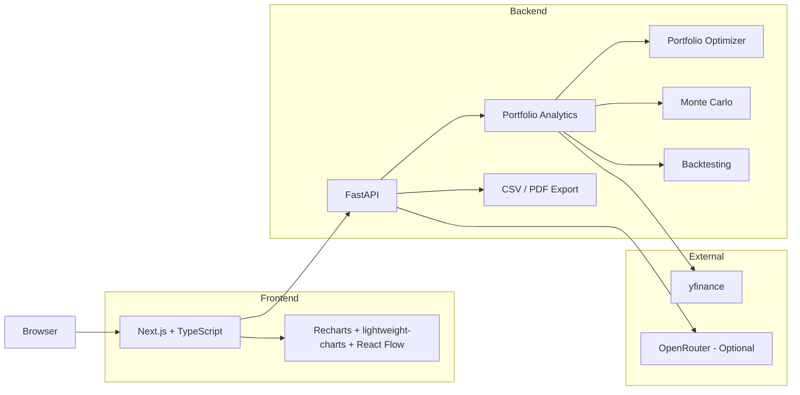

# PortfolioLens

**Build a portfolio, see its risk.**

PortfolioLens takes a set of stocks and target weights and runs the numbers a quant desk would actually look at: expected return and volatility, the efficient frontier, a Monte Carlo projection of where the portfolio could go, how it would have survived past crashes, and how a shock to one holding ripples through the rest via correlation.

I built this to get past the point where I merely understood mean-variance optimization and Monte Carlo simulation on paper. Actually implementing them against real market data turned out to be the harder and more interesting part — see [What I Learned](#what-i-learned) below for the specific ways that bit back.

---

## What it does

Add a few tickers and weights, and PortfolioLens:

* Computes annualized return, volatility, Sharpe ratio, pairwise correlation, and 1-year 95% VaR for the portfolio and each holding.
* Plots the efficient frontier — the best return achievable at each risk level — and locates the max-Sharpe and min-volatility portfolios on it, under long-only, fully-invested constraints.
* Runs a 10,000-path Monte Carlo simulation of the portfolio's value over 10 years and reports the resulting percentile bands.
* Backtests the portfolio against SPY through the 2008 crisis, the 2020 COVID crash, 2022's rate hikes, or any custom date range, and reports alpha, beta, and max drawdown.
* Breaks the portfolio down by sector and market cap, and flags concentration over 50% in any one bucket.
* Turns target weights and a total dollar value into whole-share buy/sell orders, accounting for whatever you already hold.
* Simulates a price shock at one holding and diffuses it outward across a correlation graph, so you can see which other holdings would actually be at risk — not just the one you shocked.
* Narrates all of the above through an AI assistant: rule-based risk signals by default, upgraded to LLM-written prose when an OpenRouter key is configured, plus per-ticker research and a risk-profile-based allocation suggestion.
* Exports the whole analysis to CSV or PDF.

---

## Architecture



The split is the usual one: Next.js handles input and visualization, FastAPI does the actual math. Nothing about a portfolio is persisted anywhere — it lives in memory for the length of a request and then it's gone. On the backend, `app/routers/` stays thin (parse the request, call a service, shape the response) and `app/services/` holds the framework-agnostic logic, which is what makes it possible to unit-test the quant code without spinning up FastAPI at all.

The frontend uses three different charting approaches for three different jobs, not one library stretched to cover everything: **lightweight-charts** for the two time-series charts (the backtest line and the Monte Carlo fan), because it has native log price scales, crosshairs, and price lines that a general-purpose chart lib doesn't; **Recharts** for the efficient-frontier scatter and the allocation donut, where a declarative React API is simpler than it's worth fighting a finance-specific library for; and **React Flow** for the contagion graph, which needs a custom radial layout and floating edges that neither of the other two can do.

**Backend:** FastAPI, pandas/NumPy, SciPy (optimization), yfinance (market data), RapidFuzz (ticker search), NetworkX (contagion graph), ReportLab (PDF export), OpenRouter (optional LLM narration).

**Frontend:** Next.js, TypeScript, Tailwind CSS v4, Zustand, Radix UI.

---

## How it works

### Returns and risk

Historical adjusted closing prices come from yfinance, aligned across whichever trading dates every holding actually shares (a recent IPO or a trading halt just shrinks the shared window, it doesn't break the request). Returns are simple daily returns, not log returns, so portfolio return stays a clean weighted sum of the individual holdings:

```text
Portfolio Return = w · μ
Portfolio Variance = wᵀΣw
```

`w` is the weight vector, `μ` the vector of expected (mean) returns, `Σ` the covariance matrix. Daily numbers get annualized with the standard 252-trading-day convention. Sharpe ratio, alpha, beta, max drawdown, and 1-year 95% VaR all fall out of the same return series.

### Optimization

The efficient frontier comes from minimizing portfolio volatility at each of 50 target returns using SciPy's SLSQP solver, long-only and fully invested (no shorting, weights sum to 100%). The max-Sharpe and min-volatility portfolios are two more solves of the same problem, just optimizing a different objective.

### Monte Carlo

10,000 correlated geometric Brownian motion paths, seeded from historical mean returns and covariance. A Cholesky decomposition of the covariance matrix is what lets the simulated noise inherit the holdings' actual correlation structure instead of moving independently. The whole thing is vectorized as one `(simulations × checkpoints × assets)` NumPy array rather than looping in Python — at 10,000 paths that loop would be the slowest part of the request by a wide margin.

The result is percentile bands (5th/25th/50th/75th/95th) at each checkpoint plus a 1-year 95% VaR. It's a projection under the model's assumptions, built entirely from what already happened — not a forecast.

### Contagion

Holdings become nodes in a graph, edges connect pairs correlated above 0.35, and a shock at one node propagates outward with its impact decaying by a configurable factor at each hop. It's a simplified heat-diffusion model, not a real econometric contagion model — it's meant to be directionally useful for "what else in this portfolio would I want to watch," not a precise forecast of a crash's spread.

---

## Running locally

**Requirements:** Python 3.11+, Node.js 20+

### Backend

```bash
cd backend
python -m venv .venv
.venv\Scripts\activate       # macOS/Linux: source .venv/bin/activate
pip install -r requirements.txt
python scripts/build_ticker_index.py   # optional: builds the local ticker search index
uvicorn app.main:app --reload --port 8000
```

### Frontend

In a second terminal:

```bash
cd frontend
npm install
npm run dev
```

Open `http://localhost:3000`. It talks to `http://localhost:8000` by default; point it elsewhere with:

```env
NEXT_PUBLIC_API_BASE_URL=https://your-api.example.com
```

That variable is public config, not a secret — it just tells the browser where to send requests.

For LLM-narrated insights instead of the rule-based fallback, set this on the **backend only**:

```env
OPENROUTER_API_KEY=your_key_here
```

No key means PortfolioLens quietly falls back to deterministic, rule-based insights — the app works the same either way, just with plainer prose.

---

## Security

The core assumption is that nothing coming from the browser can be trusted, and the browser
never needs to see a secret. The frontend only talks to `/api/*` — never to OpenRouter
directly — so the API key stays server-side, and `.env` files are gitignored (only
`.env.example` templates are tracked).

A few things got more deliberate attention than the rest:

* Every endpoint is rate-limited per IP, and `/analyze` also caps how many Monte Carlo runs
  can execute at once — that's the one route doing real CPU work, so a rate limit alone
  wasn't enough to keep it from getting hammered.
* CSV exports escape any cell starting with a formula-trigger character (`=`, `+`, `-`, `@`),
  so a crafted ticker or AI-generated insight string can't turn into an executable formula
  when someone opens the file in Excel or Sheets.
* Every list field on the request/response models has a max length, including on export,
  which takes analysis data straight from the client instead of re-deriving it — that data
  gets just as much scrutiny as the primary inputs.

The rest is fairly standard: production config disables the interactive FastAPI docs,
restricts CORS to the real frontend origin, and adds the usual security headers (CSP, HSTS,
X-Frame-Options). The CSP allows `'unsafe-inline'` for scripts and styles, which isn't the
strictest possible setting — nonces don't work with statically prerendered pages, and there's
no `dangerouslySetInnerHTML` anywhere in this codebase to actually exploit it.

None of this depends on the API's URL being secret. It isn't, and it doesn't need to be.

---

## Deploying publicly

Before deploying a public instance:

* Set `ENVIRONMENT=production`.
* Set `ALLOWED_ORIGINS` to the real frontend domain.
* Keep `OPENROUTER_API_KEY` in backend environment variables only.
* Use production builds rather than development servers.
* Keep Next.js and backend dependencies updated with security patches.
* Configure resource and spending limits through the hosting provider.
* Enable trusted proxy headers only when the deployment is actually behind a trusted proxy or CDN.

Current rate limiting and analysis concurrency controls operate **per backend process**. A multi-instance deployment would require shared rate-limit infrastructure for globally consistent limits.

---

## Known limitations

Everything here is backward-looking by construction — return, volatility, and correlation
come from what already happened, and Monte Carlo and the optimizer inherit whatever bias
sits in that history. A fan chart can look pretty authoritative; it's still not a forecast.

A few other things worth knowing:

* No short selling — the optimizer is long-only, so it can't lever up on a losing holding
  the way an unconstrained solver would.
* Annualization assumes 252 trading days/year, and rebalancing math ignores transaction
  costs, taxes, and fractional shares.
* A ticker with too little price history gets dropped and the rest of the portfolio
  reweights to fill the gap, rather than failing the whole request.
* Rate limiting and the Monte Carlo concurrency cap are per backend process, not shared
  across instances — fine for one process, not yet for a real multi-instance deployment.

If you ask for AI insights or research, your holdings and computed stats get sent to
whatever LLM provider is configured to generate that response. Nothing is written to disk
either way — PortfolioLens only holds a portfolio in memory for the life of the request.

---

## Project structure

```text
PortfolioLens/
├── backend/
│   ├── app/
│   │   ├── routers/       # thin FastAPI endpoints
│   │   ├── services/      # the actual math/logic, framework-agnostic
│   │   ├── tests/
│   │   ├── models.py      # request/response schemas, shared with the frontend types
│   │   └── main.py
│   └── scripts/
│
├── frontend/
│   ├── src/
│   │   ├── app/
│   │   ├── components/
│   │   ├── hooks/
│   │   └── lib/
│   └── public/
│
└── README.md
```

More backend and frontend implementation details are available in their respective README files.

---

## What I learned

The formulas themselves ended up being the easier part of the project. Working with real market data meant dealing with different listing dates, missing trading days, portfolio alignment, edge cases, and numerical stability.

One of the more interesting issues came from Monte Carlo simulations containing zero-volatility assets, which could produce a singular covariance matrix during Cholesky decomposition. Working through problems like that gave me a much better understanding of the difference between learning a financial model and actually implementing one reliably.
